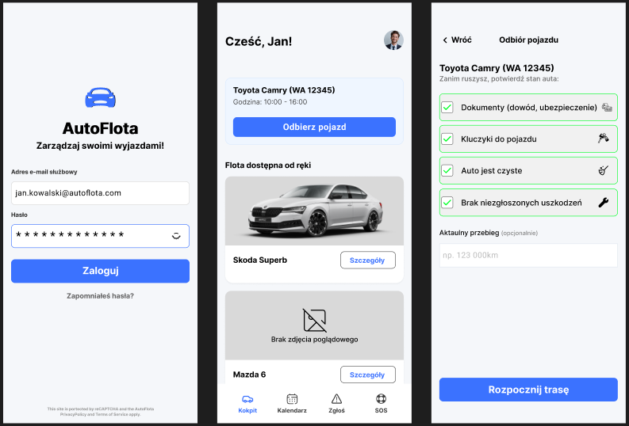

# AutoFlota

AutoFlota to mobilna aplikacja zbudowana w Expo / React Native dla zarządzania służbową flotą samochodową. Umożliwia logowanie, podgląd dzisiejszych rezerwacji, przegląd floty, rezerwacje, pomoc SOS, a w nim poradnik po kolizji.

## Co to jest

Aplikacja jest przykładowym projektem do zarządzania flotą pojazdów. Pokrywa kluczowe obszary typowe dla aplikacji mobilnych:

- logowanie użytkownika
- nawigacja zakładkowa (`Kokpit`, `Kalendarz`, `Usterki`, `SOS`)
- rezerwacja i odbiór pojazdu
- formularze check listy odbioru
- widok szczegółów pojazdu
- poradnik kolizyjny i dostęp do SOS

## Zrzuty ekranu

- `LoginScreen` — ekran logowania i weryfikacji danych
- `DashboardScreen` — główny panel z aktualną rezerwacją i szybkim dostępem do szczegółów pojazdu
- `PickupChecklistScreen` — checklista odbioru pojazdu z przyciskiem przejścia do sukcesu



## Główne funkcje

- `LoginScreen` z walidacją pola e-mail i hasła
- `BottomTabNavigator` z czterema zakładkami
- `StackNavigator` dla wewnętrznych przepływów w każdej zakładce
- dynamiczne przejście do szczegółów pojazdu
- moduł SOS z kontaktem do menedżera floty i poradnikiem kolizyjnym

## Technologie

- Expo `~54.0.33`
- React Native `0.81.5`
- React Navigation `^7.x`
- React `19.1.0`
- Playwright dla E2E
- Jest i React Native Testing Library dla testów jednostkowych i integracyjnych

## Instalacja

1. Sklonuj repozytorium:
   ```bash
   git clone <repo-url>
   cd flota-app
   ```
2. Zainstaluj zależności:
   ```bash
   npm install --legacy-peer-deps
   ```

## Uruchomienie aplikacji

- Uruchom aplikację w Expo:
  ```bash
  npm start
  ```
- Uruchom na Androidzie:
  ```bash
  npm run android
  ```
- Uruchom na iOS:
  ```bash
  npm run ios
  ```
- Uruchom na webie:
  ```bash
  npm run web
  ```

## Testy

W repozytorium znajdują się trzy poziomy pokrycia:

1. **Testy jednostkowe i komponentowe** (`Jest + React Native Testing Library`)
2. **Testy integracyjne / nawigacyjne** (`Jest` z rzeczywistą nawigacją React Navigation)
3. **Testy end-to-end (E2E)** (`Playwright` dla wersji webowej Expo)

### Uruchamianie testów

- Uruchom testy jednostkowe i integracyjne:
  ```bash
  npm test
  ```

- Uruchom testy E2E:
  ```bash
  npm run e2e
  ```

- Uruchom testy E2E w trybie widocznym:
  ```bash
  npm run e2e:headed
  ```

- Uruchom interaktywny podgląd Playwright:
  ```bash
  npm run e2e:open
  ```

## Pokrycie testów

Projekt zawiera:

- `__tests__/LoginScreen.test.js` — testy walidacji formularza, widoczności hasła i nawigacji po poprawnym logowaniu
- `__tests__/DashboardScreen.test.js` — testy renderowania danych rezerwacji i działania przycisków nawigacyjnych
- `__tests__/PickupChecklistScreen.test.js` — testy działania check listy odbioru i warunkowego włączania przycisku
- `__tests__/AppNavigation.test.js` — testy integracyjne przejść nawigacyjnych między ekranami i zakładkami
- `e2e/login.spec.js` — E2E: logowanie i podstawowa nawigacja do checklisty
- `e2e/pickup-checklist.spec.js` — E2E: przejście przez checklistę odbioru oraz ekran sukcesu

## Struktura projektu

- `App.js` — punkt wejścia aplikacji
- `src/navigation/AppNavigation.js` — konfiguracja stacków i zakładek
- `src/screens/` — wszystkie ekrany aplikacji
- `src/components/` — wspólne komponenty UI
- `src/constants/` — dane mockowane i stałe konfiguracyjne
- `__tests__/` — testy jednostkowe i integracyjne
- `e2e/` — testy Playwright E2E

## Licencja

Projekt jest prywatny i stworzony jako demonstracja implementacji aplikacji mobilnej z kompletną automatyzacją testów.
